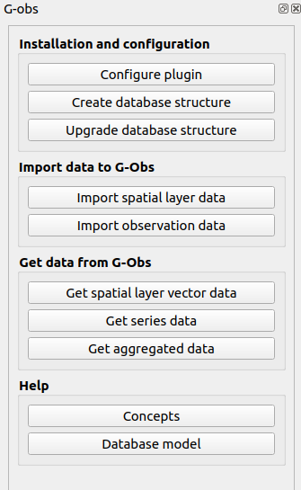

# G-Obs

* QGIS plugin repository : https://github.com/3liz/qgis-gobs-plugin/releases/latest/download/plugins.xml
* Database documentation : https://3liz.github.io/qgis-gobs-plugin/

## Contributors

## Licence

GPL V2
