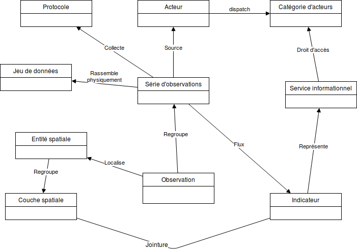

# Documentation

## Dictionnaire des concepts

### Entité spatiale

Un objet défini par une géométrie et un identifiant unique. La géométrie peut être variable dans le temps (ex: Piste). Elle est caractérisée par son type (Point, ligne, polygone, etc.), son système de coordonnées de référence.

### Couche spatiale

Un regroupement d'entités spatiales conceptuellement ou techniquement homogène, caractérisé par un nom et une source

### Observation

Une donnée caractérisée par un nom d'observable, une entité spatiale, une date, une ou des valeurs, une source ou le code du jeu de données qui la contient.

### Valeurs observées

Nous appelons valeurs les dimensions du vecteur qui porte les données d'observations.

Par exemple, si on souhaite enregistrer dans un vecteur la population des hommes et la population des femmes, le vecteur contiendra 2 valeurs "population_homme" et "population_femme". Dans la plupart des cas simples, le vecteur ne contiendra qu'une seule valeur (ex: "pluviometrie").

Chaque valeur est caractérisée par un nom (ex: "pluviometrie", un type (ex: "integer"), une unité (ex: "mm"), un alias (ex: "Pluviométrie journalière")

### Protocole

Méthode de recueil d'une série d'observations en vue d'une exploitation scientifique. Il est caractérisé un code, un nom, une description, des références bibliographiques.

### Série d'observations

Un ensemble d'observations obéissant au même protocole. Si le protocole évolue, on doit créer une nouvelle série d'observations, qui se rattache au nouveau protocole. On garde ainsi un historique qui est important pour la validation scientifique.

### Jeu de données

Un ensemble physique d'observations appartenant à la même série. En pratique, le terme est utilisé pour présenter un paquet de données présenté à un gestionnaire de données. Il est caractérisé par un code, une source. Cela peut être sous la forme d'un fichier excel par exemple.

Au moment de l'import, le gestionnaire de donnée va devoir choisir le jeu de données à importer (fichier tableur, CSV, etc.).

Les jeux de données source ne seront pas enregistrés ni conservés dans le système d'information après import et conversion en observations.

### Acteur

Un organisme ou une personne capable de produire des observations (source), d'agir dans un territoire, de signer une charte dans le cadre d'une action collective. Il fournit les jeux de données au gestionnaire de données qui pourra les transformer en observations. Il peut aussi valider les observations après avoir eu accès aux observations sous forme de services informationnels (cartes Lizmap).

### Gestionnaire de données

Il récolte et centralise les jeux de données fournis par les acteurs. C'est lui qui importe les données.

### Catégorie d'acteurs

Regroupement d'acteurs ayant les mêmes besoins en information.

### Indicateur

Un regroupement de données d'observation dans un but d'aide à la décision. Il est caractérisé par un nom, une définition, un type d'entité spatiale, une granularité et une fréquence temporelle. Soit une série d'observations, soit une formule de calcul portant sur une ou plusieurs séries d'observations et de couches spatiales. Une personne morale est choisie en tant que gestionnaire responsable.

Il peut être utilisé par exemple pour rassembler deux séries d'observations obéissant à 2 protocoles différents mais proches du point de vue de l'exploitation en vue de décider et d'agir. Par exemple, on a remplacé un capteur de température par un nouveau système plus précis, mais on a conservé les fréquences d'acquisition, les sites de mesure, etc. L'indicateur permet aussi de rassembler des données observées sur des sites ou des terrains différents.

### Chemins d'accès

Pour faciliter la navigation et le choix parmi les indicateurs, on rattache à chaque indicateur un ou plusieurs chemins d'accès. Un chemin se caractérise par une suite ordonnée de mots-clés précisant progressivement la thématique puis l'indicateur.

Par exemple, pour accéder à l'indicateur "Pluviométrie", deux chemins sont possibles

* Environnement / Changement climatique / Pluviométrie
* Gestion de l'eau / Pluviométrie

### Service informationnel

Un service de présentation d'indicateurs qui répond aux besoins et aux préférences d'une catégorie d'acteur en vue d'une aide à la décision. Par exemple des graphiques, des cartes thématiques. Est candidat pour une implémentation en tant ue projet QGIS. Un projet QGIS peut être ici le sujet de la gestion des droits.

## Modèle conceptuel de données

## Scenarios d'utilisation

On décrit dans ce chapitre les étapes essentielles à la publication de services informationnels. Chaque étape peut être conduite par des personnes différentes selon leur rôle dans la mise en oeuvre.

### Administration des données

Cette étape doit être réalisée avant l'import, en amont, pour préparer l'accueil des données. C'est le rôle de l'administrateur de données. Elle consiste à nourrir le modèle de données:

* Description des acteurs, catégories d'acteurs
* Description des protocoles
* Description séries d'observations
* Description des indicateurs
* Description des couches spatiales

Voir MCD ci-dessus.

### Gestion des données

C'est le rôle du gestionnaire de données. Cette étape consiste à:

* choisir les jeux de données à importer (feuille Excel, fichier CSV, etc.) et les couches spatiales de référence.
* importer des couches spatiales (référentiels spatiaux sur lesquels se rattachent les données d'observation)
* importer les données d'observation en précisant le lien à la couche spatiale
* rattacher ces données à la série d'observations et à un acteur (fournisseur du jeu de données).

Un journal d'import est automatiquement rempli à chaqe import d'un jeu de données. Il est caractérisé par une date, un acteur, une série d'observations et un statut de validation: import en attente de validation / import validé. Chaque observation est rattachée à un code d'import.

Lors de la création de cet import, un message est envoyé à l'acteur, avec un lien vers un service informationnel qui lui permet de visualiser les données importées (l'outil choisit la première carte accessible). Il se connecte en tant qu'acteur dans l'application de visualisation (Lizmap). Il peut alors appliquer un filtre sur les données pour ne voir que les données de l'import à valider.

Après vérification, il peut valider l'import via un élément d'interface.

Les données non validées ne sont visibles que pour certains groupes d'utilisateurs (acteurs fournisseurs de données, gestionnaires et administrateurs). Les autres utilisateurs ne voient que les données validées.

Le gestionnaire de données peut ajouter des données. Il peut réimporter un jeu de donnée amélioré par l'acteur, ce qui écrase les données non validées. On s'appui sur l'objet spatial, le vecteur, la date et la série d'observation pour gérer cette contrainte d'unicité de chaque observation (identifiant). L'outil gère automatiquement les différents cas:

* Si l'observation existe déjà et a été validée : pas d'écrasement.
* Si l'observaton n'existe pas, elle est ajoutée.
* Si l'observation existe et qu'elle n'est pas validée, elle est écrasée par la nouvelle.
* Les données orphelines sont détectées et supprimées. C'est le cas par exemple d'une observation supprimée dans le nouveau jeu d'import. On détecte lorsqu'un import B écrase au moins partiellement un import A en laissant des données orphelines (présentes dans A, pas écrasées par B).

### Création d'un service informationnel

Cela correspond à la création d'un projet QGIS, et à sa publication dans Lizmap.

A documenter.
