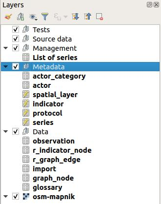

---
Title: G-Obs plugin - Admin guide
Favicon: ../icon.png
Sibling: yes
...

[TOC]

## Introduction

The **administrator** is in charge of describing the different data stored in the G-Obs database:

* actors,
* spatial layers,
* protocols,
* indicators,
* series of data.

See the (documentation on these concepts)(../concepts/).

To go on, you must first have installed and configured the G-Obs plugin for QGIS Desktop. See the doc [G-Obs installation and configuration](../installation/)

## Create your administration project

This algorithm will create a **new QGIS project file** for G-Obs administration purpose.

The generated QGIS project must then be opened by the administrator to create the needed metadata by using QGIS editing capabilities (actors, spatial layers information, indicators, etc.)

Parameters:

* `PostgreSQL connection to G-Obs database`: name of the database connection you would like to use for the new QGIS project.
* `QGIS project file to create`: choose the output file destination.

## Edit the G-Obs database metadata

The **administration project** created beforehand will allow the administrator to **create, modify and delete metadata** in the G-Obs database. As an administrator, you must open this project with QGIS.

Be sure you have a working connection between your computer and the database server.

Once opened, the QGIS project is configured to allow the administrator to edit the data. In the QGIS **Layers** panel, you will see the following layers:

These layers represent the G-Obs PostgreSQL tables which are in charge of storing the metadata and data. In QGIS, you can edit the table data by toggling the **editing mode** for each layer:

* Select the layer in the panel by clicking on it: the layer is highlighted in blue
* Right-click on the layer name and select `Toggle Editing`

Before going on, please **toggle editing** for all the following layers:

* actor_category
* actor
* spatial_layer
* indicator
* protocol
* series

We will illustrate the administration task with an example, by editing these layers in the same order as above. Please refer to the (documentation on G-Obs concepts)(../concepts/) to understand the procedure.

### actor_category

### actor

### spatial_layer

### indicator

### protocol

### series

