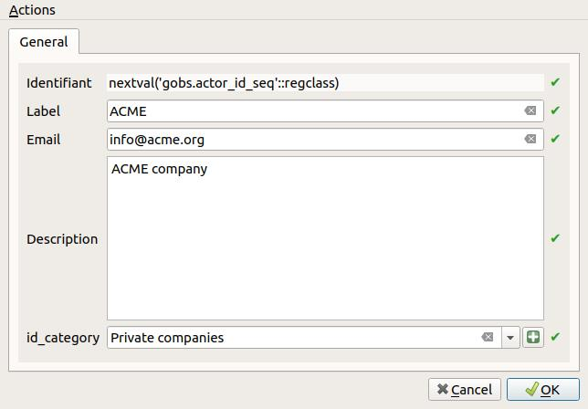
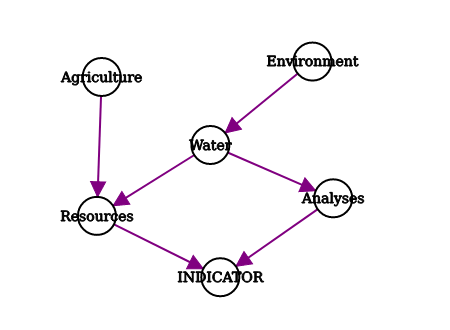

---
Title: G-Obs plugin - Admin guide
Favicon: ../icon.png
Sibling: yes
...

[TOC]

## Introduction

The **administrator** is in charge of describing the different data stored in the G-Obs database:

* actors,
* spatial layers,
* protocols,
* indicators,
* series of data.

See the [documentation on these concepts](../concepts/).

To go on, you must first have installed and configured the G-Obs plugin for QGIS Desktop. See the doc [G-Obs installation and configuration](../installation/)

## Create your database local interface

This algorithm will create a **new QGIS project file** for G-Obs administration purpose.

The generated QGIS project must then be opened by the administrator to create the needed metadata by using QGIS editing capabilities (actors, spatial layers information, indicators, etc.)

Parameters:

* `PostgreSQL connection to G-Obs database`: name of the database connection you would like to use for the new QGIS project.
* `QGIS project file to create`: choose the output file destination. We advise you to choose a name reflecting the G-Obs database name.

## Edit the database metadata

### The administration project

The **administration project** created beforehand will allow the administrator to **create, modify and delete metadata** in the G-Obs database. As an administrator, you must open this project with QGIS.

Before going on, be sure you have a working connection between your computer and the database server.

Once opened, the QGIS project is configured to allow the administrator to edit the data. In the QGIS **Layers** panel, you will see the following layers:

These layers represent the G-Obs PostgreSQL tables which are in charge of storing the metadata and data. They are organized in two groups in the Layers panel:

* `Metadata`: group containing the layers you need to edit to add metadata on actors, protocols, series, etc.
* `Data`: group containing the data stored in the database. **Do no edit these layers**

### How to edit the metadata

In QGIS, you can edit the layer data by toggling the **editing mode** for each layer:

* Select the layer in the panel by clicking on it: the layer is highlighted in blue
* Right-click on the layer name and select `Toggle Editing` or use the menu `Layer / Toggle Editing`

Before going on, please **toggle editing** for all the following layers:

* actor_category
* actor
* spatial_layer
* indicator
* protocol
* series

Please refer to the [documentation on G-Obs concepts](../concepts/) to understand the meaning of each layer.

To **add a new record**, select the layer in the `Layers` panel, then use the menu `Edit / Add record` (or `CTRL+.`). It will open a form wich lets you enter the needed data. Once every required fields have been filled, validate with the `OK` button on the bottom-right.

To **view all the records** of a layer, select the layer in the `Layers` panel, then open the attribute table with the menu `Layers / Open attribute table` (or `F6`)

You can **undo previous modifications** with the menu `Edit / Undo` (or `CTRL+Z`).

To permanently **save the changed data** in the layer, you need to use the menu `Layer / Saver layer edits`. After saving the data, you will not be able to undo your changes (but you can always reopen the data and changed the values).

To **edit a record**, open the layer attribute table, and then click on the small button `Switch to form view` on the bottom-right of the dialog (the first one). Then select a record in the left panel, and use the displayed form to edit the data.

To **delete a record**, select the record in the attribute table by clicking on the line number on the left: the line must be highlighted in blue. Then use the trash icon `Delete selected features` (or `Del`). *You can undo the deletion if you have not yet saved layer edits*.

### Example data

#### actor_category

Example content:

| id | ac_label             | ac_description |
|----|----------------------|----------------|
| 1  | Public organizations |                |
| 2  | Research centers     |                |

Notes:

* **Id** will be automatically given after saving layer edits. Do not modify.
* **Label** and **description** are mandatory

#### actor

Example content

| id                                 | a_label          | a_description                                                                                                                                               | a_email          | id_category |
|------------------------------------|------------------|-------------------------------------------------------------------------------------------------------------------------------------------------------------|------------------|-------------|
| 1                                  | IGN              | French national geographical institute.                                                                                                                     | contact@ign.fr   | 1           |
| 3                                  | DREAL Bretagne   | Direction régionale de l'environnement, de l'aménagement et du logement, région Bretagne.                                                                   | email@dreal.fr   | 1           |
| 2                                  | CIRAD            | The French agricultural research and international cooperation organization working for the sustainable development of tropical and Mediterranean regions.  | contact@cirad.fr | 2           |

Notes:

* **Id** will be automatically given after saving layer edits. Do not modify.
* **All fields** are mandatory
* The **list of categories** is taken from the `actor_category` table. You should add new entry in this table beforehand if needed.

#### spatial_layer

Example content

| id | sl_code         | sl_label                    | sl_description                                       | sl_creation_date | fk_id_actor | sl_geometry_type |
|----|-----------------|-----------------------------|------------------------------------------------------|------------------|-------------|------------------|
| 1  | pluviometers    | Pluviometers                | Sites equiped with pluviometers to measure rainfalls | 2019-06-26       | 2           | point            |
| 2  | brittany-cities | Cities of Brittany , France | Cities of Brittany, France                           | 2019-07-05       | 2           | multipolygon     |

Notes:

* **Id** will be automatically given after saving layer edits. Do not modify.
* **All fields** are mandatory
* **Label** will be used as the display name
* **Code** will be used as a unique text identifier for the spatial layer. **Please do not use spaces, accentuated characters or punctuation symbol**.
* **Geometry type** must be chosen with care and must reflect the data type of the source vector layer to import for these spatial layer. Usually, for polygon layers, it is safer to use MultiPolygon (to be able to represent islands or holes)
* **Actors** combobox comes from the data of the `actor` layer
* **Creation date** is automatically set with the current date, but you can change it if needed.

#### indicator

Example content

| id | id_code     | id_label            | id_description                            | id_date_format | id_value_code | id_value_name | id_value_type | id_value_unit | id_paths                                                                |
|----|-------------|---------------------|-------------------------------------------|----------------|---------------|---------------|---------------|---------------|-------------------------------------------------------------------------|
| 1  | pluviometry | Hourly pluviometry  | Hourly rainfall pluviometry in millimetre | hour           | pluviometry   | Pluviometry   | real          | mm            | Environment / Water / Data \| Physical and chemical conditions / Water  |
| 2  | population  | Population          | Number of inhabitants for city            | year           | population    | Population    | integer       | people        | Socio-eco / Demography / Population                                     |

Notes:

* **Id** will be automatically given after saving layer edits. Do not modify.
* **Code** is the unique text identifier of the indicator. **Please do not use spaces, accentuated characters or punctuation symbol**.
* **Label** is the display name
* **Date** format is the temporal resolution of the data which will be imported for this indicator. Please choose with care, depending on the source data and the information you would like to create from it.
* The fields **Codes, Names, Types and Units** allow to define one or many **dimensions** for this indicator. You can add one item in each field with the plus `+` button, or delete the selected one with the minus `-` button. The order of the data entered for each field **must be respected**. For example, if the indicator has two dimensions to store weather data: temperature & hygrometry, you could use:

    - **Codes**: Code of the dimension. **Please do not use spaces, accentuated characters or punctuation symbol**

    | Value       |
    |-------------|
    | temperature |
    | hygrometry  |

    - **Names**: Label of the dimension. You can use any necessary characters

    | Value       |
    |-------------|
    | Température |
    | Hygrométrie |

    - **Types**: data type. You **must** choose among: `text`, `integer`, `real`, `date`, `timestamp`, `boolean`

    | Value       |
    |-------------|
    | real        |
    | integer     |

    - **Units**: Unit of the dimension. You can use any text.

    | Value       |
    |-------------|
    | °C          |
    | %           |

* The **Paths** can be used to define an **oriented graph** which will help the future users to find the indicator among many.

    - separated words or expressions **with a coma** `,` will define a list of nodes. For example, `Environment, Agriculture` will define two independant nodes `Environment` and `Agriculture`
    - separated keywords **with a  slash** `/` will also define nodes, but also parent to child relations. For example, `Environment / Water / Analyses` will create 3 nodes `Environment`, `Water` and `Analyses`. `Environment` is the parent of `Water`, which is the parent of `Analyses`
    - You can combine them, for example `Environment / Water / Analyses, Environment / Water / Resources, Agriculture / Resources` will lead to the following graph:

    

#### protocol

Example content

| id | pr_code           | pr_label    | pr_description                              |
|----|-------------------|-------------|---------------------------------------------|
| 1  | cirad-pluviometry | Pluviometry | Measure of rainfall in mm                   |
| 2  | cirad-population  | Population  | Number of inhabitants obtained from census. |

Notes:

* **Id** will be automatically given after saving layer edits. Do not modify.
*  **All fields** are mandatory
* **Label** will be used as the display name.
* **Code** is a unique text identifier for the protocol. **Please do not use spaces, accentuated characters or punctuation symbol**
* **Description** allows to enter multiple lines to describe the protocol.

#### series

Example content

| id | fk_id_protocol | fk_id_actor | fk_id_indicator | fk_id_spatial_layer |
|----|----------------|-------------|-----------------|---------------------|
| 1  | 1              | 2           | 1               | 1                   |
| 2  | 2              | 2           | 2               | 2                   |

Notes:

* **Id** will be automatically given after saving layer edits. Do not modify.
* **All fields** are mandatory
* A series is caracterized by **a protocol, an actor, an indicator and a spatial layer**. You must have created needed items beforehand in the corresponding layers (and save those layers edits) before creating the series.
