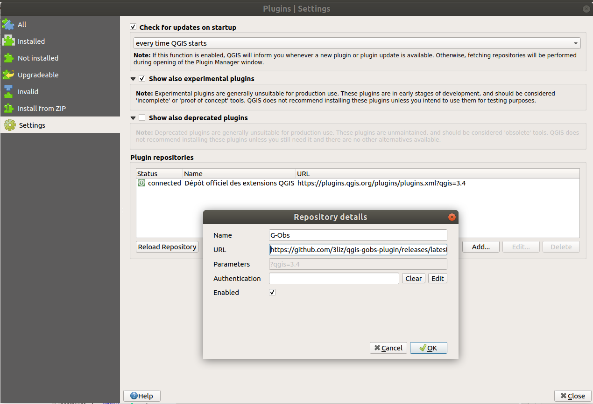
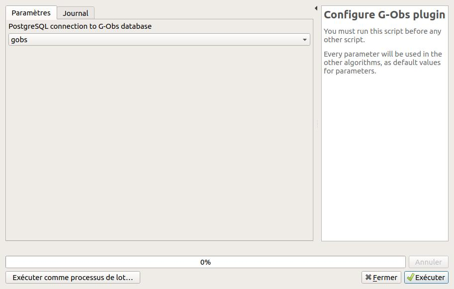
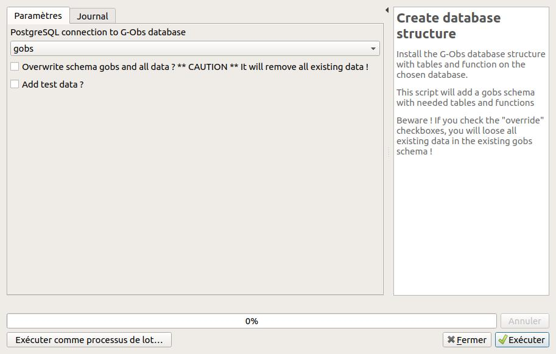
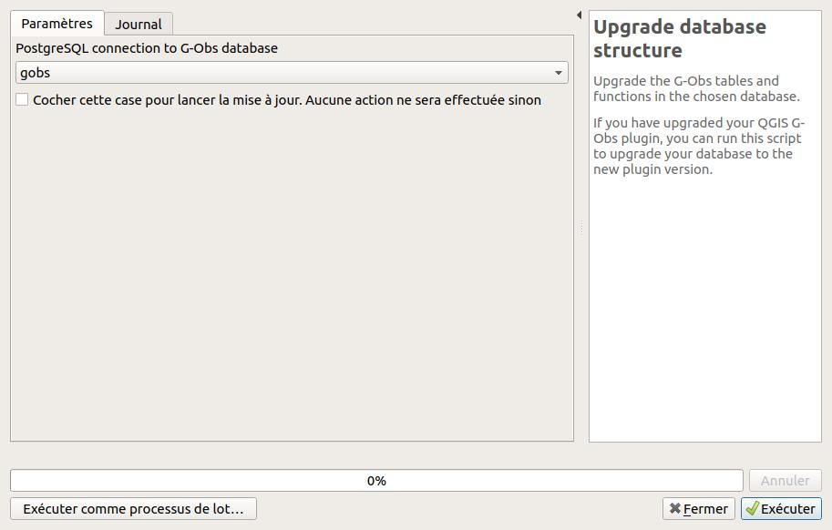

---
Title: G-Obs plugin - Installation and configuration
Favicon: ../icon.png
Sibling: yes
...

[TOC]

## Introduction

**G-Obs** is a set of tools to store and manage spatial and time data in a standardized way.

To use it, you need to:

* install QGIS Desktop
* install the plugin G-Obs for QGIS
* add a connection to a PostgreSQL database with PostGIS extension
* install the G-Obs database structure on this PostgreSQL database

## Get QGIS Desktop

The administrator must use the **QGIS desktop software**, version 3.4.x or above, to edit these needed metadata.

You can download QGIS in the [official download page](https://qgis.org/fr/site/forusers/download.html)

## Install G-Obs plugin

At present, G-Obs is not yet in QGIS official plugin repository. To install the plugin, you need to:

* open QGIS **Plugin manager** (menu Plugins)
* in the **Parameters** tab, add a new plugin repository name **G-Obs** with the URL: https://github.com/3liz/qgis-gobs-plugin/releases/latest/download/plugins.xml

* In the **All** tab, search for the word `obs` and install the **G-Obs** plugin.

After a successfull installation, you should see a new dock called **G-Obs**

For further details, you can have a look at [3liz documentation web page](https://3liz.github.io/add_qgis_repository.html).

## Add a connection to the PostgreSQL database

G-Obs stores all the data in a **PostgreSQL database**, with the PostGIS extension installed (to manage spatial data).

You need to have access to a PostgreSQL database, with enough rights to create a database **schema** and **tables** inside this schema.

In QGIS, use the **Datasource manager** under the **Layer** menu to create a new PostgreSQL connection:

* Activate the **PostgreSQL tab** (elephant icon)
* Click on the **New** button
* In the creation dialog, fill the needed information, and use the **Test connection** button to make sure the credentials are ok.

We advise to:

* use a **service connection** instead of the basic authentication. See [QGIS documentation](https://docs.qgis.org/3.4/fr/docs/user_manual/managing_data_source/opening_data.html#postgresql-service-connection-file)
* check the boxes `Use estimated table metadata` and `Also list tables with no geometry`

Once your connection is set up, you can create the G-Obs database structure in your PostgreSQL database

## Configure the G-Obs plugin

This algorithm will allow to configure G-Obs extension for the current QGIS project.

You must run this script before any other script.

Parameters:

* `PostgreSQL connection to G-Obs database`: name of the database connection you would like to use for the current QGIS project. This connection will be used for the other algorithms.

## Create the G-Obs database structure

Install the G-Obs database structure with tables and function on the chosen database connection.

This script will add a gobs schema with needed tables and functions.

Parameters:

* `PostgreSQL connection to G-Obs database`: name of the database connection you would like to use for the installation.

## Upgrade database structure

Upgrade the G-Obs tables and functions in the chosen database.

If you have upgraded your QGIS G-Obs plugin, you can run this script to upgrade your database to the new plugin version.

Parameters:

* `PostgreSQL connection to G-Obs database`: name of the database connection you would like to use for the upgrade.

