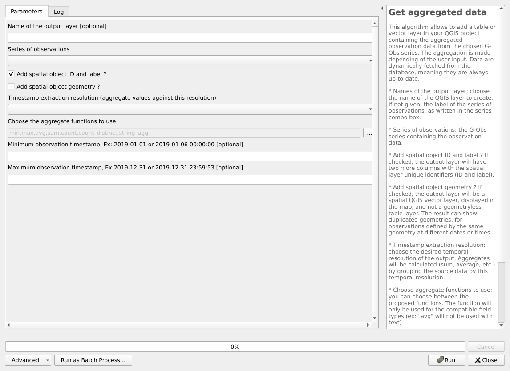
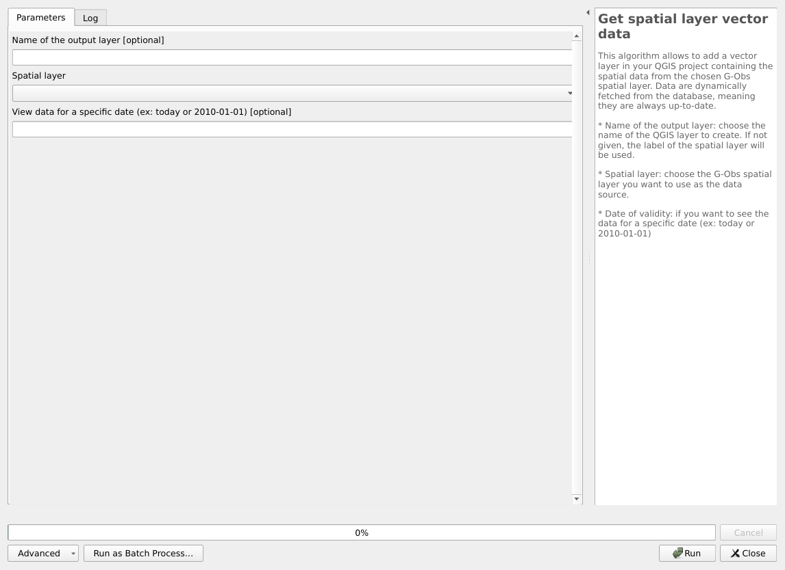

---
hide:
  - navigation
---

# Processing

## Configuration

### Configure G-Obs plugin

This algorithm will allow to configure G-Obs extension for the current QGIS project

You must run this script before any other script.

* PostgreSQL connection to G-Obs database: name of the database connection you would like to use for the current QGIS project. This connection will be used for the other algorithms.

#### Parameters

| ID | Description | Type | Info | Required | Advanced | Option |
|:-:|:-:|:-:|:-:|:-:|:-:|:-:|
CONNECTION_NAME|PostgreSQL connection to G-Obs database|ProviderConnection|The database where the schema 'gobs' will be installed.|✓|||

#### Outputs

| ID | Description | Type | Info |
|:-:|:-:|:-:|:-:|
OUTPUT_STATUS|Output status|Number||
OUTPUT_STRING|Output message|String||

***

## Administration

### Create database local interface

This algorithm will create a new QGIS project file for G-Obs administration purpose.

The generated QGIS project must then be opened by the administrator to create the needed metadata by using QGIS editing capabilities (actors, spatial layers information, indicators, etc.)

* PostgreSQL connection to G-Obs database: name of the database connection you would like to use for the new QGIS project.
* QGIS project file to create: choose the output file destination.

#### Parameters

| ID | Description | Type | Info | Required | Advanced | Option |
|:-:|:-:|:-:|:-:|:-:|:-:|:-:|
CONNECTION_NAME|Connection to the PostgreSQL database|ProviderConnection|The database where the schema GObs has been installed.|✓|||
PROJECT_FILE|QGIS project file to create|FileDestination||✓|||

#### Outputs

| ID | Description | Type | Info |
|:-:|:-:|:-:|:-:|
PROJECT_FILE|QGIS project file to create|File||
OUTPUT_STATUS|Output status|Number||
OUTPUT_STRING|Output message|String||

***

## Structure

### Create database structure

Install the G-Obs database structure with tables and function on the chosen database.

This script will add a gobs schema with needed tables and functions

* PostgreSQL connection to G-Obs database: name of the database connection you would like to use for the installation.

Beware ! If you check the "override" checkboxes, you will loose all existing data in the existing gobs schema !

#### Parameters

| ID | Description | Type | Info | Required | Advanced | Option |
|:-:|:-:|:-:|:-:|:-:|:-:|:-:|
CONNECTION_NAME|Connection to the PostgreSQL database|ProviderConnection|The database where the schema 'gobs' will be installed.|✓|||
OVERRIDE|Overwrite schema gobs and all data ? ** CAUTION ** It will remove all existing data !|Boolean||✓|||
ADD_TEST_DATA|Add test data ?|Boolean||✓|||
ADD_OBSERVATION_DATA|Add observation test data ?|Boolean||✓|||

#### Outputs

| ID | Description | Type | Info |
|:-:|:-:|:-:|:-:|
OUTPUT_STATUS|Output status|Number||
OUTPUT_STRING|Output message|String||

***

### Upgrade database structure

Upgrade the G-Obs tables and functions in the chosen database.

If you have upgraded your QGIS G-Obs plugin, you can run this script to upgrade your database to the new plugin version.

* PostgreSQL connection to G-Obs database: name of the database connection you would like to use for the upgrade.

#### Parameters

| ID | Description | Type | Info | Required | Advanced | Option |
|:-:|:-:|:-:|:-:|:-:|:-:|:-:|
CONNECTION_NAME|Connection to the PostgreSQL database|ProviderConnection|The database where the schema 'gobs' will be installed.|✓|||
RUN_MIGRATIONS|Check this box to upgrade. No action will be done otherwise|Boolean||✓|||

#### Outputs

| ID | Description | Type | Info |
|:-:|:-:|:-:|:-:|
OUTPUT_STATUS|Output status|Number||
OUTPUT_STRING|Output message|String||

***

## Tools

### Get aggregated data

This algorithm allows to add a table or vector layer in your QGIS project containing the aggregated observation data from the chosen G-Obs series. The aggregation is made depending of the user input. Data are dynamically fetched from the database, meaning they are always up-to-date.
* Names of the output layer: choose the name of the QGIS layer to create. If not given, the label of the series of observations, as written in the series combo box.
* Series of observations: the G-Obs series containing the observation data.
* Add spatial object ID and label ? If checked, the output layer will have two more columns with the spatial layer unique identifiers (ID and label).
* Add spatial object geometry ? If checked, the output layer will be a spatial QGIS vector layer, displayed in the map, and not a geometryless table layer. The result can show duplicated geometries, for observations defined by the same geometry at different dates or times.
* Timestamp extraction resolution: choose the desired temporal resolution of the output. Aggregates will be calculated (sum, average, etc.) by grouping the source data by this temporal resolution.
* Choose aggregate functions to use: you can choose between the proposed functions. The function will only be used for the compatible field types (ex: "avg" will not be used with text)
* Minimum observation timestamp: if you enter a valid ISO timestamp in this field, only observations with a timestamp after this value will be processed.
* Maximum observation timestamp: if you enter a valid ISO timestamp in this field, only observations with a timestamp before this value will be processed.

#### Parameters

| ID | Description | Type | Info | Required | Advanced | Option |
|:-:|:-:|:-:|:-:|:-:|:-:|:-:|
OUTPUT_LAYER_NAME|Name of the output layer|String|||||
SERIE|Series of observations|Enum||✓||Values:   |
SERIE_ID|Series ID. If given, it overrides previous choice|Number||✓||Default: -1   Type: Integer  Min: -1.7976931348623157e+308, Max: 1.7976931348623157e+308  |
ADD_SPATIAL_OBJECT_DATA|Add spatial object ID and label ?|Boolean||✓||Default: True   |
ADD_SPATIAL_OBJECT_GEOM|Add spatial object geometry ?|Boolean||✓|||
TEMPORAL_RESOLUTION|Timestamp extraction resolution (aggregate values against this resolution)|Enum||✓||Values: original, second, minute, hour, day, week, month, year  |
AGGREGATE_FUNCTIONS|Choose the aggregate functions to use|Enum||✓||Default: [0, 1, 2, 3, 4, 5, 6]   Values: min, max, avg, sum, count, count_distinct, string_agg  |
MIN_TIMESTAMP|Minimum observation timestamp, Ex: 2019-01-01 or 2019-01-06 00:00:00|String|||||
MAX_TIMESTAMP|Maximum observation timestamp, Ex:2019-12-31 or 2019-12-31 23:59:53|String|||||

#### Outputs

| ID | Description | Type | Info |
|:-:|:-:|:-:|:-:|
OUTPUT_STATUS|Output status|Number||
OUTPUT_STRING|Output message|String||
OUTPUT_LAYER|Output layer|VectorLayer||
OUTPUT_LAYER_RESULT_NAME|Output layer name|String||

***

### Get series data

This algorithm allows to add a table layer in your QGIS project containing the observation data from the chosen G-Obs series. Data are dynamically fetched from the database, meaning they are always up-to-date.
* Name of the output layer: choose the name of the QGIS table layer to create. If not given, the label of the series will be used, by concatening the label of the indicator, protocol, source actor and spatial layer defining the chosen series.
* Series of observations: choose the G-Obs series of observation you want to use as the data source.
* Add spatial object geometry ? If checked, the output layer will be a spatial QGIS vector layer, displayed in the map, and not a geometryless table layer. The result can show duplicated geometries, for observations defined by the same geometry at different dates or times.

#### Parameters

| ID | Description | Type | Info | Required | Advanced | Option |
|:-:|:-:|:-:|:-:|:-:|:-:|:-:|
OUTPUT_LAYER_NAME|Name of the output layer|String|||||
SERIE|Series of observations|Enum||✓||Values:   |
SERIE_ID|Series ID. If given, it overrides previous choice|Number||✓||Default: -1   Type: Integer  Min: -1.7976931348623157e+308, Max: 1.7976931348623157e+308  |
ADD_SPATIAL_OBJECT_GEOM|Add spatial object geometry ?|Boolean||✓|||

#### Outputs

| ID | Description | Type | Info |
|:-:|:-:|:-:|:-:|
OUTPUT_STATUS|Output status|Number||
OUTPUT_STRING|Output message|String||
OUTPUT_LAYER|Output layer|VectorLayer||
OUTPUT_LAYER_RESULT_NAME|Output layer name|String||

***

### Get the list of series

#### Parameters

| ID | Description | Type | Info | Required | Advanced | Option |
|:-:|:-:|:-:|:-:|:-:|:-:|:-:|
No parameter

#### Outputs

| ID | Description | Type | Info |
|:-:|:-:|:-:|:-:|
OUTPUT_STATUS|Output status|Number||
OUTPUT_STRING|Output message|String||
OUTPUT_LAYER|Output layer|VectorLayer||
OUTPUT_LAYER_RESULT_NAME|Output layer name|String||

***

### Get spatial layer vector data

This algorithm allows to add a vector layer in your QGIS project containing the spatial data from the chosen G-Obs spatial layer. Data are dynamically fetched from the database, meaning they are always up-to-date.
* Name of the output layer: choose the name of the QGIS layer to create. If not given, the label of the spatial layer will be used.
* Spatial layer: choose the G-Obs spatial layer you want to use as the data source.
* Date of validity: if you want to see the data for a specific date (ex: today or 2010-01-01)

#### Parameters

| ID | Description | Type | Info | Required | Advanced | Option |
|:-:|:-:|:-:|:-:|:-:|:-:|:-:|
OUTPUT_LAYER_NAME|Name of the output layer|String|||||
SPATIALLAYER|Spatial layer|Enum||✓||Values:   |
SPATIALLAYER_ID|Spatial layer ID. If given, it overrides previous choice|Number||✓||Default: -1   Type: Integer  Min: -1.7976931348623157e+308, Max: 1.7976931348623157e+308  |
VALIDITY_DATE|View data for a specific date (ex: today or 2010-01-01)|String|||||

#### Outputs

| ID | Description | Type | Info |
|:-:|:-:|:-:|:-:|
OUTPUT_STATUS|Output status|Number||
OUTPUT_STRING|Output message|String||
OUTPUT_LAYER|Output layer|VectorLayer||
OUTPUT_LAYER_RESULT_NAME|Output layer name|String||

***

### Remove series data

This algorithms allows to completely delete observation data for a specific series
* Series of observations: the G-Obs series containing the observation data.
* Check this box to delete: this box must be checked in order to proceed. It is mainly here as a security. Please check the chosen series before proceeding !
* Also delete the series item: if you want to delete not only the observation data of the series, but also the series item in the table.

#### Parameters

| ID | Description | Type | Info | Required | Advanced | Option |
|:-:|:-:|:-:|:-:|:-:|:-:|:-:|
SERIE|Series of observations|Enum||✓||Values:   |
SERIE_ID|Series ID. If given, it overrides previous choice|Number||✓||Default: -1   Type: Integer  Min: -1.7976931348623157e+308, Max: 1.7976931348623157e+308  |
RUN_DELETE|Check this box to delete. No action will be done otherwise|Boolean||✓|||
DELETE_SERIES|Also delete the series item|Boolean||✓|||

#### Outputs

| ID | Description | Type | Info |
|:-:|:-:|:-:|:-:|
OUTPUT_STATUS|Output status|Number||
OUTPUT_STRING|Output message|String||

***

### Remove spatial layer data

This algorithms allows to completely delete spatial layer data (objects) for a specific spatial layer
* Spatial layer: choose the G-Obs spatial layer.
* Check this box to delete: this box must be checked in order to proceed. It is mainly here as a security. Please check the chosen spatial layer before proceeding !
* Also delete the spatial layer item: if you want to delete not only the spatial objects of the spatial layers, but also the spatial layer item in the table.

#### Parameters

| ID | Description | Type | Info | Required | Advanced | Option |
|:-:|:-:|:-:|:-:|:-:|:-:|:-:|
SPATIALLAYER|Spatial layer|Enum||✓||Values:   |
SPATIALLAYER_ID|Spatial layer ID. If given, it overrides previous choice|Number||✓||Default: -1   Type: Integer  Min: -1.7976931348623157e+308, Max: 1.7976931348623157e+308  |
RUN_DELETE|Check this box to delete. No action will be done otherwise|Boolean||✓|||
DELETE_SPATIAL_LAYER|Also delete the spatial layer item|Boolean||✓|||

#### Outputs

| ID | Description | Type | Info |
|:-:|:-:|:-:|:-:|
OUTPUT_STATUS|Output status|Number||
OUTPUT_STRING|Output message|String||

***

## Import

### Import spatial layer data

This algorithm allows to import data from a QGIS spatial layer into the G-Obs database

The G-Obs administrator must have created the needed spatial layer beforehand by addind the required items in the related database tables: gobs.actor_category, gobs.actor and gobs.spatial_layer.
* Target spatial layer: choose one of the spatial layers available in G-Obs database
* Source actor: choose the actor among the pre-defined list of actors
* Source data: choose the QGIS vector layer containing the spatial data you want to import into the chosen spatial layer.
* Unique identifier: choose the field containing the unique ID. It can be an integer or a text field, but must be unique.
* Unique label: choose the text field containing the unique label of the layer feature. You could use the QGIS field calculator to create one if needed.
* Start of validity: choose the field with the start timestamp of validity for each feature. Leave empty if all the features share the same date/time and manually enter the value in the next input. This field content must respect the ISO format. For example 2020-05-01 10:50:30 or 2020-01-01
* Start of validity for all features Specify the start timestamp of validity for all the objects in the spatial layer. This value must respect the ISO format. For example 2020-05-01 10:50:30 or 2020-01-01
* End of validity: choose the field with the end timestamp of validity for each feature. Leave empty if all the features share the same date/time and manually enter the value in the next input. This field content must respect the ISO format. For example 2020-05-01 10:50:30 or 2020-01-01
* End of validity for all features Specify the end timestamp of validity for all the objects in the spatial layer. This value must respect the ISO format. For example 2020-05-01 10:50:30 or 2020-01-01
* SQL Filter You can specify a valid SQL filter to restrict the data from the source to be imported. For example : hiker = 'Al'

#### Parameters

| ID | Description | Type | Info | Required | Advanced | Option |
|:-:|:-:|:-:|:-:|:-:|:-:|:-:|
SPATIALLAYER|Target spatial layer|Enum||✓||Values:   |
ACTOR|Source actor|Enum||✓||Values:   |
SOURCELAYER|Source data|VectorLayer||✓||Type:   |
UNIQUEID|Unique identifier|Field||✓|||
UNIQUELABEL|Unique label|Field||✓|||
DATE_VALIDITY_MIN|Start timestamp of validity. Field in ISO Format|Field|||||
MANUAL_DATE_VALIDITY_MIN|Manual start timestamp of validity (2019-01-06 or 2019-01-06 22:59:50)|String|||||
DATE_VALIDITY_MAX|End timestamp of validity. Field in ISO Format|Field|||||
MANUAL_DATE_VALIDITY_MAX|Manual end timestamp of validity (2019-01-31 or 2019-01-31 23:59:59)|String|||||
SQL_FILTER|Optionnal SQL filter to restrict data to be imported|String|||||

#### Outputs

| ID | Description | Type | Info |
|:-:|:-:|:-:|:-:|
OUTPUT_STRING|Output message|String||

***

