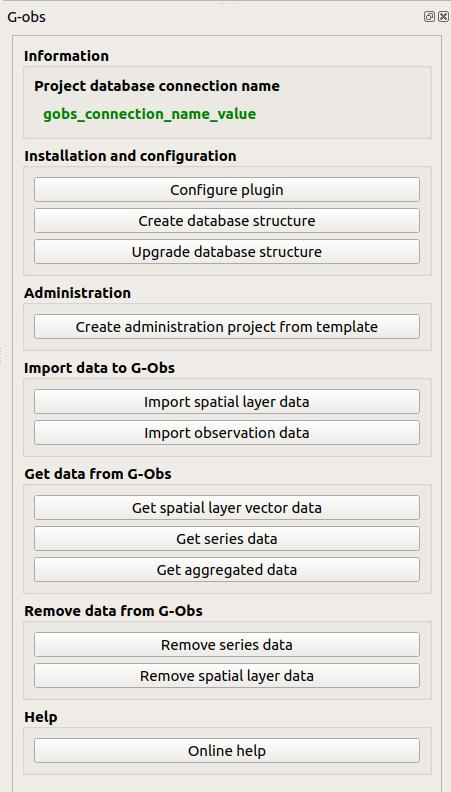
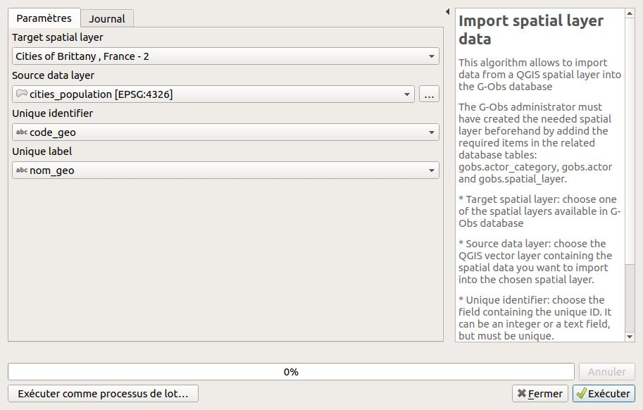
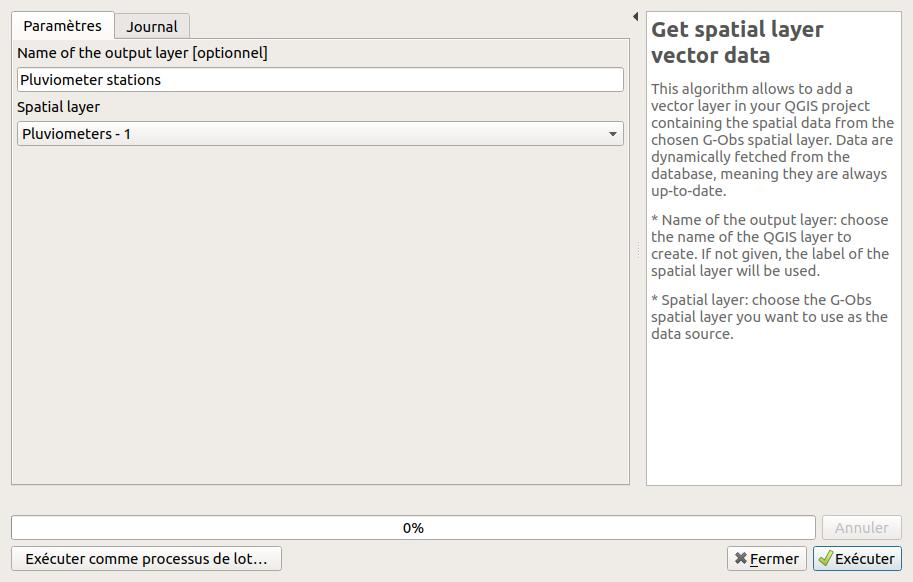
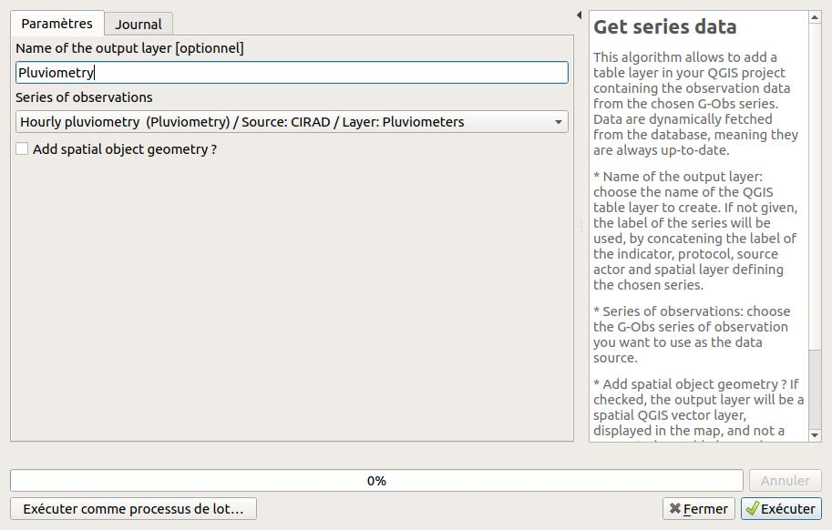
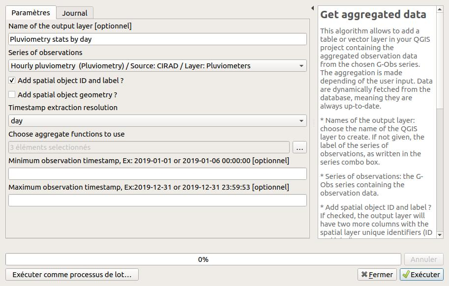
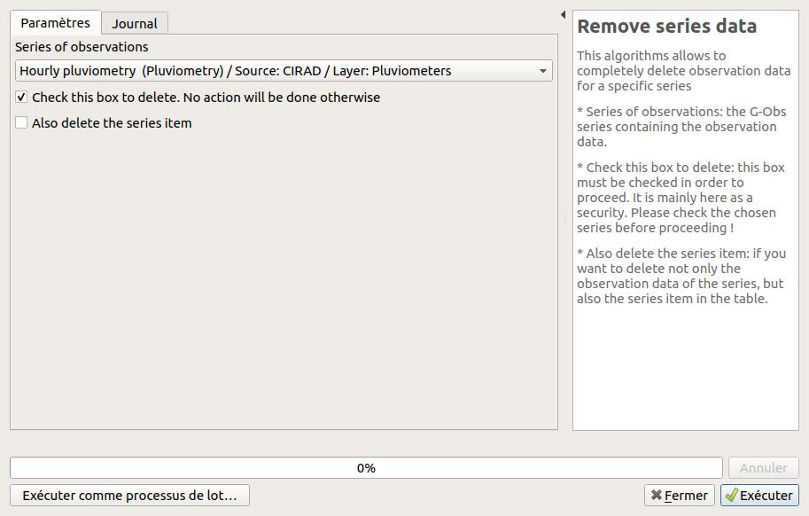
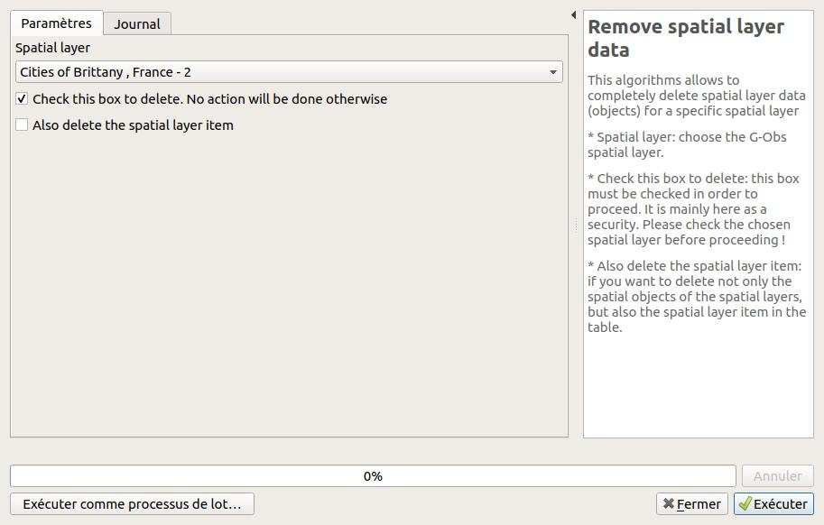

---
Title: G-Obs plugin - User guide
Favicon: ../icon.png
Sibling: yes
...

[TOC]

## Introduction

## G-Obs interface

## Algorithms

### Import spatial layer data

This algorithm allows to import data from a QGIS spatial layer into the G-Obs database

The G-Obs administrator must have created the needed spatial layer beforehand by addind the required items in the related database tables: gobs.actor_category, gobs.actor and gobs.spatial_layer.

* Target spatial layer: choose one of the spatial layers available in G-Obs database
* Source data layer: choose the QGIS vector layer containing the spatial data you want to import into the chosen spatial layer.
* Unique identifier: choose the field containing the unique ID. It can be an integer or a text field, but must be unique.
* Unique label: choose the text field containing the unique label of the layer feature. You could use the QGIS field calculator to create one if needed.

### Get spatial layer vector data

This algorithm allows to add a vector layer in your QGIS project containing the spatial data from the chosen G-Obs spatial layer. Data are dynamically fetched from the database, meaning they are always up-to-date.

* Name of the output layer: choose the name of the QGIS layer to create. If not given, the label of the spatial layer will be used.
* Spatial layer: choose the G-Obs spatial layer you want to use as the data source.

### Get series data

This algorithm allows to add a table layer in your QGIS project containing the observation data from the chosen G-Obs series. Data are dynamically fetched from the database, meaning they are always up-to-date.

* Name of the output layer: choose the name of the QGIS table layer to create. If not given, the label of the series will be used, by concatening the label of the indicator, protocol, source actor and spatial layer defining the chosen series.
* Series of observations: choose the G-Obs series of observation you want to use as the data source.
* Add spatial object geometry ? If checked, the output layer will be a spatial QGIS vector layer, displayed in the map, and not a geometryless table layer. The result can show duplicated geometries, for observations defined by the same geometry at different dates or times.

### Get aggregated data

This algorithm allows to add a table or vector layer in your QGIS project containing the aggregated observation data from the chosen G-Obs series. The aggregation is made depending of the user input. Data are dynamically fetched from the database, meaning they are always up-to-date.

* Names of the output layer: choose the name of the QGIS layer to create. If not given, the label of the series of observations, as written in the series combo box.
* Series of observations: the G-Obs series containing the observation data.
* Add spatial object ID and label ? If checked, the output layer will have two more columns with the spatial layer unique identifiers (ID and label).
* Add spatial object geometry ? If checked, the output layer will be a spatial QGIS vector layer, displayed in the map, and not a geometryless table layer. The result can show duplicated geometries, for observations defined by the same geometry at different dates or times.
* Timestamp extraction resolution: choose the desired temporal resolution of the output. Aggregates will be calculated (sum, average, etc.) by grouping the source data by this temporal resolution.
* Choose aggregate functions to use: you can choose between minimum (min), maximum (max), average (avg) and  sum.
* Minimum observation timestamp: if you enter a valid ISO timestamp in this field, only observations with a timestamp after this value will be processed.
* Maximum observation timestamp: if you enter a valid ISO timestamp in this field, only observations with a timestamp before this value will be processed.

### Remove series data

This algorithms allows to completely delete observation data for a specific series

* Series of observations: the G-Obs series containing the observation data.
* Check this box to delete: this box must be checked in order to proceed. It is mainly here as a security. Please check the chosen series before proceeding !
* Also delete the series item: if you want to delete not only the observation data of the series, but also the series item in the table.

### Remove spatial layer data

This algorithms allows to completely delete spatial layer data (objects) for a specific spatial layer

* Spatial layer: choose the G-Obs spatial layer.
* Check this box to delete: this box must be checked in order to proceed. It is mainly here as a security. Please check the chosen spatial layer before proceeding !
* Also delete the spatial layer item: if you want to delete not only the spatial objects of the spatial layers, but also the spatial layer item in the table.

